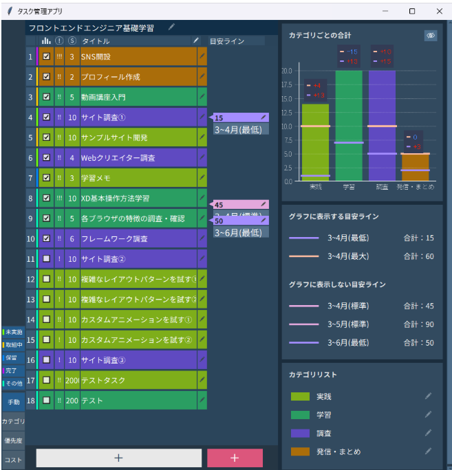

# Tkinter-タスク管理アプリ

- タスクと目安ラインを登録・修正・削除する
- タスクに登録した想定コストの合計値を目安ラインと比較

＊行うタスクの検討や特定タスクの所要時間の記録などに使用することを想定

## 特徴（Features）

- シンプルな機能に絞ったユーティリティツール
- PCのみ

## ダウンロード

最新版の実行ファイルはこちらからダウンロードできます：

[Download v0.1.0 (.exe)](https://github.com/ktskd-hi/tkinter-task-app/releases/tag/v0.1.0)

## 使い方

1. アプリを起動
2. タスク・目安ラインを追加
3. 必要に応じてタイトルや数値を編集

マニュアルはこちらからご覧いただけます：

[マニュアル](https://ktskd-hi.github.io/task-app-manual/1-1_%E7%94%BB%E9%9D%A2%E3%81%AE%E6%A6%82%E8%A6%81.html)

## 動作環境

- Windows 10 / 11

## 作者（Author）

- 名前：ktskd

## ライセンス
本ソフトウェアは学習目的に限り利用可能です。
商用利用・再配布は禁止です。
詳しくは LICENSE ファイルをご確認ください。

